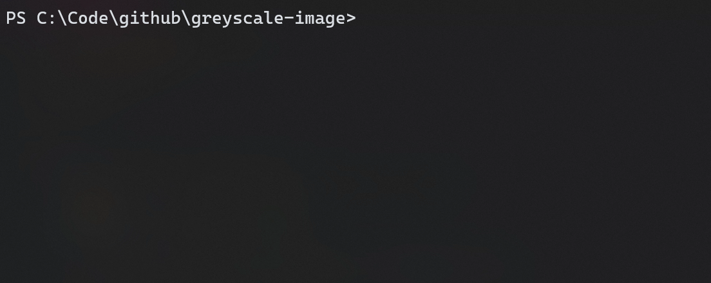

# **greyscale-image**


Learning application to greyscale an image.




## **Running**
<details>
<summary>Python 🐍</summary>
Currently supports <code>.jpg</code> files only.

### **Installing Requirements**
```bash
$ cd greyscale-image
$ pip install -r ./requirements.txt
```

### **Running**
```bash
$ cd greyscale-image
$ python3 src/python/main.py [INPUT_FILE_PATH]
# Output will be `output.jpg`
```

</details>


<details>
<summary>Rust 🦀</summary>

### **Building & Running**
```bash
$ cd greyscale-image
$ cargo build --release
$ ./target/release/greyscale-image [INPUT_FILE_PATH] [OUTPUT_FILE_PATH]
```

</details>